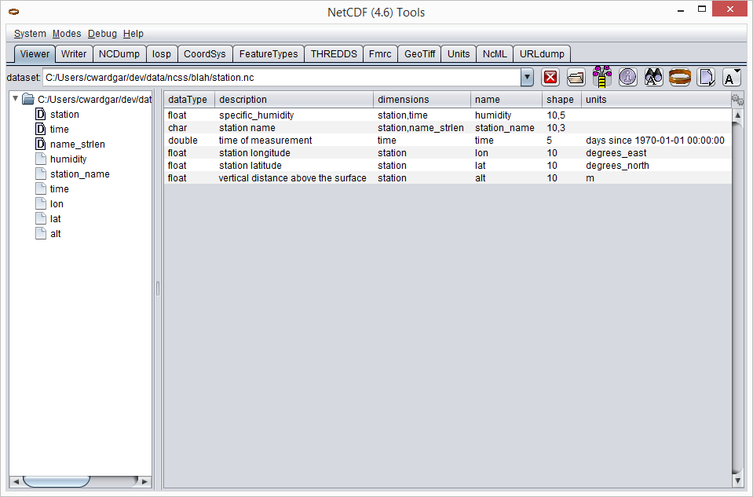
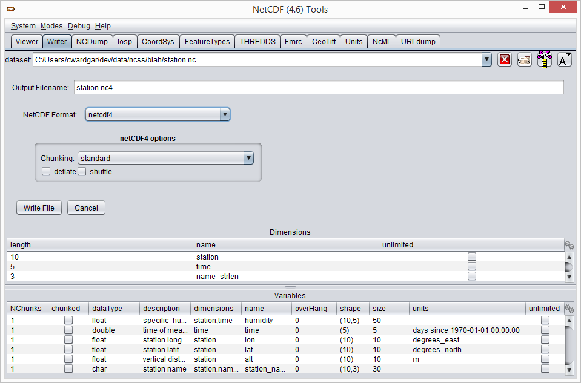
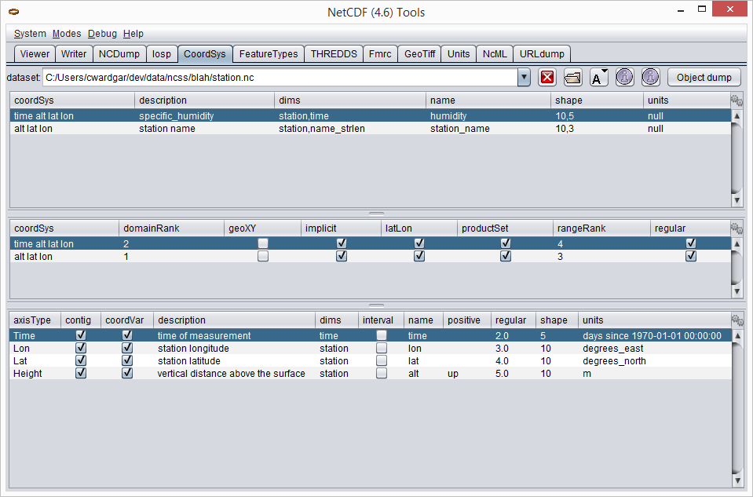
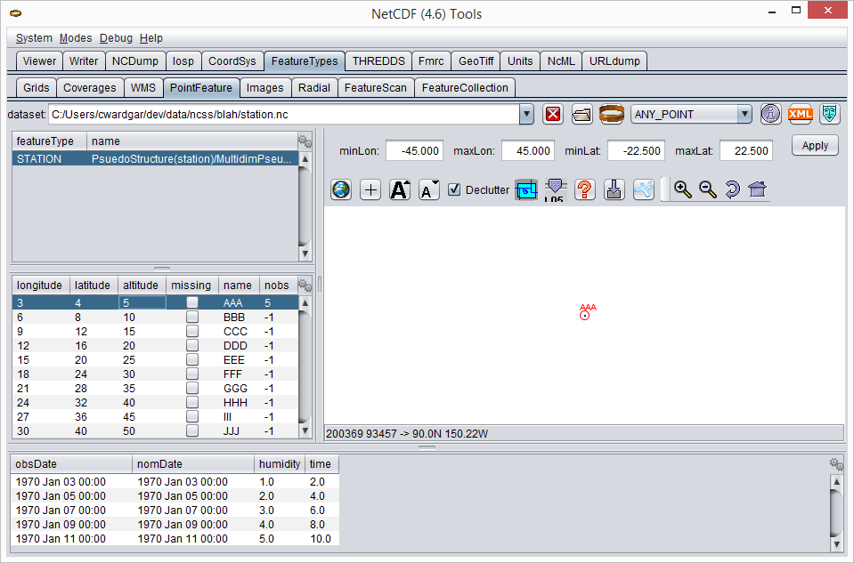

:source-highlighter: coderay
[[threddsDocs]]

= ToolsUI
:linkcss:
:stylesheet: ../../cdm.css

== Running ToolsUI

=== Download and run locally
You can download `toolsUI.jar` from either the NetCDF-Java
link:/downloads/netcdf/netcdf-java-4/index.jsp[downloads] or
link:../../documentation.htm#current[documentation] pages.
You can then run the ToolsUI application using a command similar to: 
----
java -Xmx1g -jar toolsUI.jar
----
Alternatively, on many operating systems, you can simply double-click the JAR file.

=== Launch from Web Start
Simply click link:../../webstart/netCDFtools.jnlp[here] to launch ToolsUI from your browser.

== Tabs

=== Viewer
The Viewer tab reads a dataset and displays its metadata in a tabular format.

==== Testing dataset readability
The NetCDF-Java library can read data from a wide variety of <<../formats/FileTypes#,scientific data formats>>.
To check that your dataset can be read by NetCDF-Java, try to open it in the Viewer tab. You can open it in two ways:

* Enter the URL or file path of the dataset in the "dataset" field. Then hit the "Enter" key.
* Click the folder icon and select the file in the FileChooser dialog that pops up. 

If the dataset can be opened, you will see its dimensions, variables, and other details in the window. For example:

==== Showing data values
Select a variable in the table, right-click to open its context menu, and choose "NCdump Data".
The "NCDump Variable Data" dialog will pop up. Here you can print (i.e. "dump") its values to the screen. 

Here<97>using link:http://www.adt.unipd.it/corsi/Bianco/www.pcc.qub.ac.uk/tec/courses/f90/stu-notes/F90_notesMIF_5.html#HEADING41[Fortran 90 array section syntax] 
(`start:end:stride`)<97>you can print (i.e. "dump") all or part of the variable's values to the screen. By default,
the full extent of the variable's dimensions are shown, where `start` and `end` are inclusive and zero-based.
For example:

image:ncdump_variable_data1.png[Full extent]

However, you can edit that section to dump just the values you want. For example:

image:ncdump_variable_data2.png[Sliced]

In general, it's a good idea to make the number of values dumped reasonably small, if possible.

=== Writer
The Writer tab takes a dataset in <<../formats/FileTypes#,any format that NetCDF-Java can understand>> and writes
it out to NetCDF. Several NetCDF "flavors" are supported:

* netcdf3
* netcdf4
* netcdf4_classic
* netcdf3c
* netcdf3c64
* ncstream

Note: to write to NetCDF-4, you must have the <<../netcdf4Clibrary#,C library loaded>>.

=== NCDump
The NCDump tab offers functionality similar to<97>albeit more limited than<97>the
link:https://www.unidata.ucar.edu/software/netcdf/docs/ncdump-man-1.html[ncdump] utility. The string that you enter in
the "Command" field should be of the form:
----
<filename> [-cdl | -ncml] [-c | -vall] [-v varName1;varName2;..] [-v varName(0:1,:,12)]
----
image:ncdump1.png[NCDump tab]

=== CoordSys
The CoordSys tab displays the coordinate systems that NetCDF-Java identified in the dataset.

=== FeatureTypes
The sub-tabs of FeatureTypes provide detailed information about the various
<<../FeatureDatasets/Overview#,scientific feature types>> that a CDM dataset can contain.

==== FeatureTypes -> Grids
The Grids sub-tab can be used to determine if a dataset contains grids or not. Simply try to open the dataset, the
same way you did in the <<Viewer>> tab. If rows of metadata are displayed in the tables, the dataset is gridded;
otherwise it's not (or perhaps NetCDF-Java just doesn't recognize it as such).

Once you've opened the gridded data, you can click the image:redrawButton.jpg[Grid Viewer] button to display the
"Grid Viewer" dialog. Press the other image:redrawButton.jpg[Grid Viewer] button in the dialog to visualize your grid.

image:gridViewer1.png[Grid Viewer]

==== FeatureTypes -> PointFeature
The PointFeature sub-tab can be used to determine if a dataset contains
<<../FeatureDatasets/PointFeatures#,point features>> or not. Simply try to open the dataset, the same way you did
in the <<Viewer>> tab. If a metadata row appears in the top-left table, the dataset is "pointed"; otherwise it's not
(or perhaps NetCDF-Java just doesn't recognize it as such). Note that the middle-left table will populate as soon as
you choose a row in the top-left table. Similarly, the bottom table will populate as soon as you choose a row in the
middle-left table.

=== THREDDS
The THREDDS tab acts as a client to THREDDS servers. Simply input the URL of a catalog and the available datasets will
be displayed, just as if you were navigating a THREDDS server with your browser. The difference is that when you
select a dataset in the left window and then click on the "Open File", "Open CoordSys", or "Open dataset" buttons,
ToolsUI will automatically switch to the appropriate tab and show metadata about that dataset.

image:thredds1.png[THREDDS tab]

=== NcML
When you open a dataset in the NcML tab, an NcML document containing all its metadata will be generated. From here,
it's easy to modify the dataset using the <<../../ncml/Tutorial#,powers of NcML>> and write the document out to
disk.

image:ncml1.png[NcML tab]
