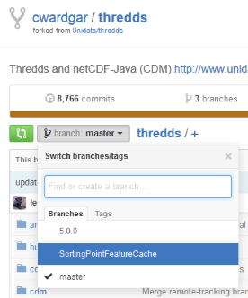
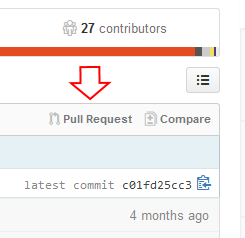

:source-highlighter: coderay
[[threddsDocs]]

:stylesheet: ../../tds/tutorial/tutorial_adoc.css
:linkcss:

= Contributing code to THREDDS

== Submitting a pull request

The THREDDS source code is hosted on link:https://github.com/[GitHub] and we use its
link:https://help.github.com/articles/using-pull-requests/[pull request] feature to accept external contributions.
Follow these steps to submit a pull request to Unidata:

. link:https://help.github.com/articles/fork-a-repo/[Fork] the
      link:https://github.com/Unidata/thredds[THREDDS repository].
.. Click the "Fork" button at the upper-right corner of the THREDDS GitHub page. This will create a copy of the
       repository under your GitHub account.
.. image:images/fork.png[Forking a repository in GitHub.]
. Clone your fork to your local computer.
.. `git clone \https://github.com/<github_user_name>/thredds.git`
. Change into the `thredds` directory.
.. `cd thredds`
. Create a branch for the changes that you will make based on `master`.
.. `git checkout -b <branch_name> master`
.. For instance: `git checkout -b fix_radar_iosp master`
. Make changes to the source code. See <<SourceCodeBuild#,this tutorial>> for help building THREDDS.
. Commit your changes using the git link:http://git-scm.com/docs/git-add[add] and
      link:http://git-scm.com/docs/git-commit[commit] commands.
. link:http://git-scm.com/docs/git-push[Push] your changes to GitHub.
.. `git push -u origin <branch_name>`
. Go to your forked THREDDS repository on GitHub (it'll be something like
      `\https://github.com/<github_user_name>/thredds`) and select the `<branch_name>` branch from the drop-down
      box at the top left.
.. 
. Click the link that says "Pull Request", review the changes, and click the green "Create pull request" button.
.. 
. Unidata will be notified of your request, and will be able to review the changes and discuss them with you before
  merging.

For more info, see GitHub's link:https://help.github.com/articles/creating-a-pull-request[Creating a pull request]
article.

=== Resources

* link:https://github.com/Unidata/git-recipes[Git recipes from Unidata]
* link:http://schacon.github.io/git/git.html[git(1) Manual Page ]
* link:http://git-scm.com/book[Pro Git book]
* link:http://gitref.org/[Git Reference]
