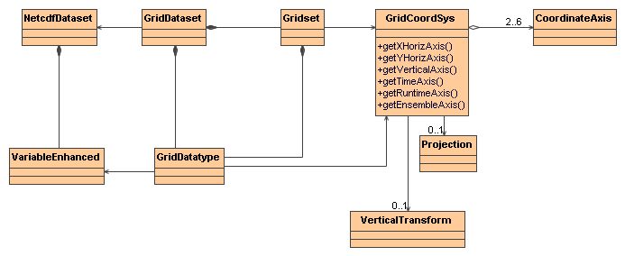

:source-highlighter: coderay
[[threddsDocs]]

= Tutorial: The Grid Feature Type

== Scientific Feature Types

The Common Data Model _*(CDM) Scientific Feature Type layer*_ adds
another layer of functionality on top of NetcdfDataset, by specializing
in various kinds of data that are common in earth science. The abstract
concepts and concrete classes are continually evolving, and we have
concentrated on, for obvious reasons, the types of datasets and data
that Unidata is most familiar with, mainly from the atmospheric and
ocean sciences.

All Scientific Feature Types have **georeferencing coordinate systems**,
from which a location in real physical space and time can be found,
usually with reference to the Earth. Each adds special _data subsetting_
methods which cannot be done efficiently or at all in the general case
of NetcdfDataset objects.

Also see overview of
<<../reference/FeatureDatasets/Overview#,Scientific Feature
Types>>.

== The Grid Feature Type

A _*Grid Coordinate System*_ at a minimum has a *Lat* and *Lon*
coordinate axis, or a *GeoX* and *GeoY* coordinate axis plus a
*Projection* that maps x, y to lat, lon. It usually has a *time*
coordinate axis. It may optionally have a *vertical* coordinate axis,
classified as **Height**, **Pressure**, or *GeoZ.* If it is a GeoZ axis,
it may have a *Vertical Transform* that maps GeoZ to height or pressure.
A Grid may also optionally have a *Runtime* and/or *Ensemble* coordinate
axis.

A _*GridDatatype*_ (aka _*GeoGrid*_ or just __*Grid*__) has a Grid
Coordinate System, whose dimensions are all __*connected*__, meaning
that neighbors in index space are connected neighbors in coordinate
space. This means that data values that are close to each other in the
real world (coordinate space) are close to each other in the data array,
and are usually stored close to each other on disk, making coordinate
subsetting easy and efficient.

A _*Grid Dataset*_ has _Grids_ that are grouped into _*Gridsets*_ based
on common Grid Coordinate Systems. Here is the UML for the _Grid_
interface classes, found in the *ucar.nc2.dt* package:

== 

==  

== Opening a GridDataset

The most general way to open a *GridDataset* is to use the
*FeatureDatasetFactoryManager* class. This allows third parties to
plug-in alternative implementations of *GridDataset* at runtime. For
example:

--------------------------------------------------------------------------------------------------------
  Formatter errlog = new Formatter();
  FeatureDataset fdataset = FeatureDatasetFactoryManager.open(FeatureType.GRID, location, null, errlog);
  if (fdataset == null) {
    log.error("**failed on {} %n --> {} %n", location, errlog);
    return null;
  }

  FeatureType ftype = fdataset.getFeatureType();
  assert (ftype == FeatureType.GRID);
  GridDataset gds = (GridDataset) fdataset;
--------------------------------------------------------------------------------------------------------

If you know that the file you are opening is a GridDataset, you can call
directly:

---------------------------------------------------------------------
       GridDataset gds = ucar.nc2.dt.grid.GridDataset.open(location);
---------------------------------------------------------------------

== Using a GridDataset

Once you have a GridDataset, you can get the grids and their associated
coordinate systems:

________________________________________________________________
----------------------------------------------------------------
  GridDatatype grid = gds.findGridDatatype( args[1]);
  GridCoordSystem gcs = grid.getCoordinateSystem();
  CoordinateAxis xAxis = gcs.getXHorizAxis();
  CoordinateAxis yAxis = gcs.getYHorizAxis();
  CoordinateAxis1D zAxis = gcs.getVerticalAxis(); // may be null

  if (gcs.hasTimeAxis1D()) {
    CoordinateAxis1DTime tAxis1D = gcs.getTimeAxis1D();
    java.util.Date[] dates = tAxis1D.getTimeDates();

  } else if (gcs.hasTimeAxis()) {
    CoordinateAxis tAxis = gcs.getTimeAxis();
  }
  ...
----------------------------------------------------------------
________________________________________________________________

A *GridCoordSystem* wraps a georeferencing coordinate system. It always
has 1D or 2D _XHoriz_ and _YHoriz_ axes, and optionally 1D vertical and
1D or 2D time axes. The XHoriz/YHoriz axes will be lat/lon if
_isLatLon()_ is true, otherwise they will be GeoX,GeoY with an
appropriate Projection. The _getBoundingBox()_ method returns a bounding
box from the XHoriz/YHoriz corner points. The _getLatLonBoundingBox()_
method returns the smallest lat/lon bounding box that contains
__getBoundingBox()__.

You can use the *GridCoordSystem* to find the value of a grid a a
specific lat, lon point:

___________________________________________________________________________________
-----------------------------------------------------------------------------------
  // open the dataset, find the variable and its coordinate system
  GridDataset gds = ucar.nc2.dt.grid.GridDataset.open(location);
  GridDatatype grid = gds.findGridDatatype( "myVariableName");
  GridCoordSystem gcs = grid.getCoordinateSystem();

  double lat = 8.0;
  double lon = 21.0;

  // find the x,y index for a specific lat/lon position
  int[] xy = gcs.findXYindexFromLatLon(lat, lon, null); // xy[0] = x, xy[1] = y

  // read the data at that lat, lon and the first time and z level (if any)
  Array data  = grid.readDataSlice(0, 0, xy[1], xy[0]); // note order is t, z, y, x
  double val = data.getDouble(0); // we know its a scalar
  System.out.printf("Value at %f %f == %f%n", lat, lon, val);
  ...
-----------------------------------------------------------------------------------
___________________________________________________________________________________

Most GridCoordSystems have a CoordinateAxis1DTime time coordinate. If
so, you can get the list of dates from it.

A *GridDatatype* is like a specialized Variable that explicitly handles
X,Y,Z,T dimensions, which are put into canonical order: (t, z, y, x). It
has various convenience routines that expose methods from the
_GridCoordSystem_ and _VariableDS_ objects__.__ The main data access
method is __readDataSlice__,  where you can fix an index on any
Dimension, or use a -1 to get all the data in that Dimension.

_______________________________________________________________
---------------------------------------------------------------
// get 2D data at timeIndex, levelIndex
Array data = grid.readDataSlice(timeIndex, levelIndex, -1, -1);
---------------------------------------------------------------
_______________________________________________________________

The subset method allows you to create a logical subset of a GeoGrid
using index Ranges.

_____________________________________________________________________________________________________
-----------------------------------------------------------------------------------------------------
GridDatatype subset = grid.makeSubset(rt_range, ens_range, null, t_range, z_range, y_range, x_range);
-----------------------------------------------------------------------------------------------------
_____________________________________________________________________________________________________

== **Writing a GridDataset to a Netcdf-3 fil**e *using CF-1.0
Conventions*

Once you have a GridDataset, you can write it as a Netcdf-3 file using
the http://cfconventions.org/[CF Conventions], using
_*ucar.nc2.dt.grid.NetcdfCFWriter*_

-----------------------------------------------------------------------------------------------------------------------
      NetcdfCFWriter writer = new NetcdfCFWriter();
      writer.makeFile(filename, gds, gridList, boundingBox, timeRange, addLatLon, horizStride, vertStride, timeStride);

  /**
   * Write a CF compliant Netcdf-3 file from any gridded dataset.
   *
   * @param location    write to this location on disk
   * @param gds         A gridded dataset
   * @param gridList    the list of grid names to be written, must not be empty. Full name (not short).
   * @param llbb        optional lat/lon bounding box
   * @param range       optional time range
   * @param addLatLon   should 2D lat/lon variables be added, if its a projection coordainte system?
   * @param horizStride x,y stride
   * @param stride_z    not implemented yet
   * @param stride_time not implemented yet
   * @throws IOException           if write or read error
   * @throws InvalidRangeException if subset is illegal
   */
  public void makeFile(String location, ucar.nc2.dt.GridDataset gds, List<String> gridList,
          LatLonRect llbb, DateRange range,
          boolean addLatLon,
          int horizStride, int stride_z, int stride_time)
          throws IOException, InvalidRangeException;
-----------------------------------------------------------------------------------------------------------------------

== Using ToolsUI to look at Grids

You can use ToolsUI *FeatureTypes/Grids* Tab to view Grid Datasets. This
consists of 3 tables that show the Grid DataTypes, the Grid Coordinate
systems, and the Coordinate Axes, eg:

image:images/gridUI.png[image]

Use the image:images/redrawButton.jpg[image] button to display the grids
in the Grid Viewer.

image:images/gridView.png[image]

'''''

image:../nc.gif[image] This document was last updated July 2013
