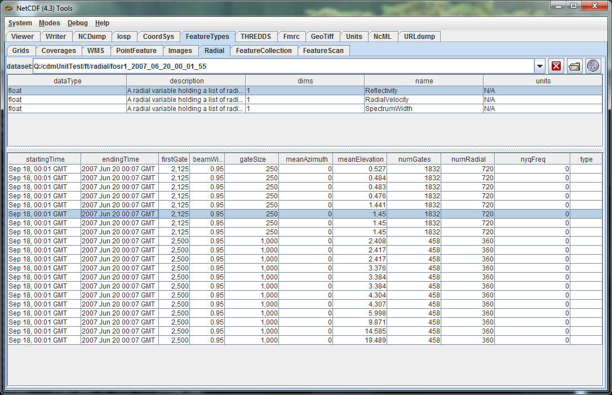

:source-highlighter: coderay
[[threddsDocs]]
= Tutorial: The Radial Scientific Feature Type

== The Radial Datatype

_*Radial Datatype*_ uses polar coordinates (elevation, azimuth,
distance) to describe the location of its points in space, and it is
referred as __*Radial Coordinate System*__. A _*Radial Coordinate
System*_ has a **Elevation**, **Azimuth**, and *Distance* coordinate
axis. It may also has a *Time* coordinate axis. Generally, in our level
II and level III radar products, there is a time variable at radial
(elevation, azimuth), or sweep (elevation) level, so it is considered as
a variable, rather than coordinate axis.

A _*RadialDatasetSweep*_ has a collection of _*Radial Variables.*_ The
data in each Variable is organized into __*sweeps*__. A sweep is a
connected set of __*radials*__. All the radials in a sweep are assumed
to have the same number of gates and the same _*beam width*_ and
__*nyquist frequency*__. A _*radial*_ is a set of data sampled along a
straight line at constant intervals called the **gate size**. The
radial’s geometry is described by an _*elevation*_ and _*azimuth
angles*_ relative to some origin.

A _*RadialDatasetSweep*_ is a _NetcdfDataset_ whose _Radials_ have been
identified and grouped into _*Sweeps*_ based on Radial Coordinate
Systems. Here is the UML for the _RadialDatasetSweep_ interface classes,
found in the *ucar.nc2.dt* package:

image:../images/Radial.png[image]

==  

== Opening and using a RadialDatasetSweep

The general way to open a RadialDataset is to use
FeatureDatasetFactoryManager

----------------------------------------------------------------------------------------------------------
  Formatter errlog = new Formatter();
  FeatureDataset fdataset = FeatureDatasetFactoryManager.open(FeatureType.RADIAL, location, null, errlog);
  if (fdataset == null) {
    log.error("**failed on {} %n --> {} %n", location, errlog);
    return null;
  }

  FeatureType ftype = fdataset.getFeatureType();
  assert (ftype == FeatureType.RADIAL);
  RadialDatasetSweep radialDataset = (RadialDatasetSweep) fdataset;
----------------------------------------------------------------------------------------------------------

*TypedDatasetFactory* wraps three RadialDatasetSweep classes:
**ucar.nc2.dt.radial.Nids2Dataset**,
**ucar.nc2.dt.radial.LevelII2Dataset**, and
**ucar.nc2.dt.radial.Dorade2Dataset**. It opens a radial dataset with an
appropriate class, and can be extended to cover more radial products. If
the radar is stationary, _isStationary()_ returns true, and
_getCommonOrigin()_ returns the earth location of radar. If the radar
product has more than one sweep, _isVolume()_ will return 1. The
_getDataVariables_ returns the list of variables, for each variable,
__getNumSweeps()__, __getSweep(int sweepNum)__, and _readAllData()_ is
used to handle the data variable at the sweep level, inside each sweep,
__getRadialNumber()__, __getGateNumber()__, __getElevation(int
radial)__, __getTime(int radial)__, and _readData(int radial)_ returns
all information associated with the radial object. +

== Example of Retrieving information from a RadialDataset

-----------------------------------------------------------------------------------------------------------
  private void showInfo(RadialDatasetSweep rds, String varName, Formatter f) {
    f.format("Radial Dataset %s%n", rds.getLocation());

      /* radar information */
    String stationID = rds.getRadarID();
    String stationName = rds.getRadarName();
    boolean isVolume = rds.isVolume();
    f.format("  stationName = %s%n", stationName);
    f.format("  isVolume = %s%n", isVolume);

      /* radial variable */
    RadialDatasetSweep.RadialVariable v = (RadialDatasetSweep.RadialVariable) rds.getDataVariable(varName);
    f.format("  info for variable = %s%n", varName);
    f.format("  number of sweeps = %d%n", v.getNumSweeps());

    // loop over sweeps
    for (int sweep = 0; sweep < v.getNumSweeps(); sweep++) {
      RadialDatasetSweep.Sweep sw = v.getSweep(sweep);
      float me = sw.getMeanElevation();
      int nrays = sw.getRadialNumber();
      int ngates = sw.getGateNumber();
      f.format("    %d : elev=%f nrays=%d ngates=%d%n", sweep, me, nrays, ngates);

      try {
        for (int j = 0; j < nrays; j++) {
          float azi = sw.getAzimuth(j);
          float ele = sw.getElevation(j);
          float[] data = sw.readData(j);
          f.format("      %d : azimuth=%f elev=%f data len=%d%n", j, azi, ele, data.length);
        }
      } catch (IOException e) {
        e.printStackTrace();
      }
    }
  }

-----------------------------------------------------------------------------------------------------------

== Using ToolsUI to look at Radial Dataset

You can use ToolsUI *FeatureTypes/Radial* Tab to view Radial Datasets.
The top table lists the RadialVariables in the dataset, and selecting
one of these shows the Sweeps that are contained by that variable.

 

 +

Like all CDM datasets, you can also use ToolsUI Viewer Tab to view the
netCDF structure of a Radial Dataset: +
 +
 image:images/TuiViewerRadialDataset.png[image] +
 +
 +
 Use the IDVto display the Radial Dataset of a level II product, showing
3D sweep of elevation angle 0.5 degree: +
 +

image:images/IDV3DSweep.png[3DSweep] +

 +
 and volume image of Reflectivity which is composed of 9 elevation
sweeps: +
 +

image:images/IDVVolume.png[IDV volume] +

'''''

image:../nc.gif[image] This document was last updated July 2013

 +
