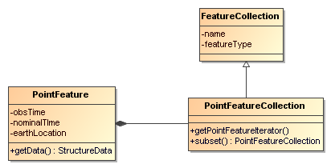
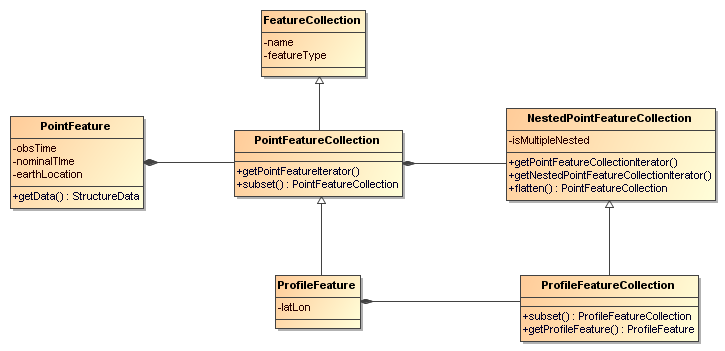
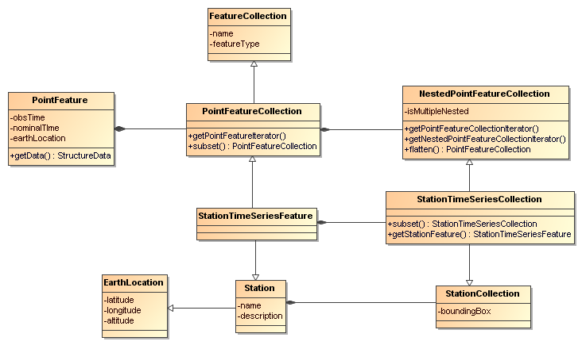

Point Feature Datasets
----------------------

Point Feature Datasets (also known as Discrete Sampling Geometry (DSG) datasets) are collections of Point Features. Point Feature Datasets contain one
or more FeatureCollections:

---------------------------------------------------------------------------------------
  public interface ucar.nc2.ft.FeatureDatasetPoint extends ucar.nc2.ft.FeatureDataset {
    List<FeatureCollection> getPointFeatureCollectionList();
  }
---------------------------------------------------------------------------------------

Point Feature Datasets will contain *PointFeatureCollections* or **NestedPointFeatureCollections**, described below. We take the approach that all
point feature types are arrangements of collections of _PointFeatures_ (a set of measurements at the same point in space and time), distinguished by
the geometry and topology of the collections. The *_Point Feature Types_* that we implement are:

1.  *Point feature* : one or more parameters measured at one point in time and space.
2.  *Station time series feature* : a time-series of data points all at the same location, with varying time.
3.  *Profile feature* : a set of data points along a vertical line.
4.  *Station Profile feature* : a time-series of profile ****features at a named location.
5.  *Trajectory feature* : a set of data points along a 1D curve in time and space.
6.  *Section feature* : a collection of profile**** features which originate along a trajectory.

Related documents:
^^^^^^^^^^^^^^^^^^

* CF 1.6 http://cfconventions.org/1.6.html#discrete-sampling-geometries[Discrete Sampling Geometries Conventions]
* CDM Feature Types _draft_ link:../../CDM/CDMfeatures.doc[doc]
* CDM Point Feature Types _draft_ link:../../CDM/CDMpoints.doc[doc]
* Complete link:PointUML.html[Point Feature UML]

'''''

Point Features
~~~~~~~~~~~~~~

A *PointFeature* is a collection of data (usually observational) taken at a single time and a single place:

[source,java]
----------------------------------------------------------------
  public interface ucar.nc2.ft.PointFeature {
    ucar.unidata.geoloc.EarthLocation getLocation();

    double getObservationTime();
    Date getObservationTimeAsDate();
    double getNominalTime();
    Date getNominalTimeAsDate();
    DateUnit getTimeUnit();

    ucar.ma2.StructureData getData() throws java.io.IOException;
  }
----------------------------------------------------------------

The time can be retrieved as a Date or as a double. The actual time of the data sample is the **observation time**. It is common in some observational
systems to bin data into standard intervals, in which case there is also a **nominal time**. When the nominal time is not given in the data, it is
usually set to the observational time, which must always be present.

The location is represented by:

[source,java]
------------------------------------------------------
  public interface ucar.unidata.geoloc.EarthLocation {
    double getLatitude();
    double getLongitude();
    double getAltitude();
    ucar.unidata.geoloc.LatLonPoint getLatLon();
  }
------------------------------------------------------

The _latitude_ and _longitude_ are required, while the _altitude_ may be missing and if so, is set to __Double.NaN__. altitude units and datum ??

The actual data of the observation is contained in a **link:../StructureData.html#StructureData[ucar.ma2.StructureData]**, which has a collection of
*StructureMembers* which describe the individual data members**,** along with many convenience routines for extracting the data.

*PointFeatureIterator*
^^^^^^^^^^^^^^^^^^^^^^

One way to access data in point feature collections is to iterate over the data with a *PointFeatureIterator.*

[source,java]
---------------------------------------------------------
 public interface ucar.nc2.ft.PointFeatureIterator extends AutoCloseable, Iterator<PointFeature> {
   boolean hasNext();
   ucar.nc2.ft.PointFeature next();
   void close();
 }
---------------------------------------------------------

When the iteration is complete, any system resources used by it are released. If the iteration is not completed, you must explicitly call finish().
*_Therefore best practice is to put your iteration in a try-with-resource block like_*:

[source,java]
------------------------------------------------------------------
  try (PointFeatureIterator pfi = collection.getPointFeatureIterator()) {
   while (pfi.hasNext()) {
     ucar.nc2.ft.PointFeature pf = pfi.next();
     ...
   }
 }
------------------------------------------------------------------

Note that calling __hasNext__() is required before calling __next__(), and the order in which the PointFeatures are returned is arbitrary, if not
otherwise specified.

An alternative way to access data is to use the *_foreach_* construct, as shown in the examples below.

*PointFeatureCollection*
^^^^^^^^^^^^^^^^^^^^^^^^

A PointFeatureCollection is a collection of PointFeatures:

[source,java]
---------------------------------------------------------------------------------------------
  public interface ucar.nc2.ft.PointFeatureCollection extends FeatureCollection, Iterable<PointFeature> {
    String getName();
    int size();
    ucar.nc2.units.DateRange getDateRange();
    ucar.unidata.geoloc.LatLonRect getBoundingBox();
    void calcBounds();
    
    PointFeatureIterator getPointFeatureIterator(int buffersize);
    PointFeatureCollection subset(ucar.unidata.geoloc.LatLonRect, ucar.nc2.units.DateRange);
  }
---------------------------------------------------------------------------------------------

All FeatureCollections have a _name_ that must be unique within its containing collection (if any). The _size_ of its collection is the number of
PointFeatures that will be returned by the iterator. The size, boundingBox, and dateRange may not be known until after iterating through the
collection, that is, actually reading the data. You can force the discovery of these by calling calcBounds(), but that may cost a complete iteration
through the data.

PointFeatureCollection implements Iterable<PointFeature>, so can be used in a *_foreach_* block::

[source,java]
----------------------------------------------------
   for (PointFeature pf : pointFeatureCollection) {
     ...
   }
----------------------------------------------------

You may subset a PointFeatureCollection with a lat/lon bounding box, and/or a dateRange:

[source,java]
-----------------------------------------------------------------------------------------------------------
  ucar.nc2.units.DateFormatter dformat = new ucar.nc2.units.DateFormatter()
  PointFeatureCollection subset = pointFeatureCollection.subset(new LatLonRect("40,-105,2,2"), 
        new DateRange( dformat.getISODate("1999-09-31T12:00:00"), null, new TimeDuration("3 days"), null); 

  // get all the points in that subset
  for (PointFeature pf : subset) {
    ...
  } 
-----------------------------------------------------------------------------------------------------------

'''''

*Profile Feature Collection*
~~~~~~~~~~~~~~~~~~~~~~~~~~~~

A *ProfileFeature* is a set of PointFeatures along a vertical line.

[source,java]
--------------------------------------------------------------------------------------------------------
  public interface ProfileFeature extends PointFeatureCollection {
    String getName();
    ucar.unidata.geoloc.LatLonPoint getLatLon();
    int size();

    ucar.nc2.ft.PointFeatureCollection subset(ucar.unidata.geoloc.LatLonRect, ucar.nc2.units.DateRange);
  }
--------------------------------------------------------------------------------------------------------

Note that a *ProfileFeature* is a collection of PointFeatures, extending **PointFeatureCollection**. In this case, the iteration will return
PointFeatures that all belong to the same profile, with the same lat/lon point and varying heights. The number of points in the collection may be
available through the __size__() method. When that number can only be determined by reading through the data, a -1 is returned.

Note that the *subset* method, inherited from the _PointFeatureCollection_ interface, is not normally useful here, since the lat/lon values are
identical. The time values are also often identical, although that is not required.

ProfileFeatureCollection
^^^^^^^^^^^^^^^^^^^^^^^^

A ProfileFeature is a __PointFeatureCollection__, and a collection of ProfileFeatures is a **ProfileFeatureCollection**, which extends
NestedPointFeatureCollection:

[source,java]
-----------------------------------------------------------------------------------------------------------------
  public interface ProfileFeatureCollection extends FeatureCollection, NestedPointFeatureCollection {
    String getName();
    int size();

    ucar.nc2.ft.ProfileFeatureCollection subset(ucar.unidata.geoloc.LatLonRect);
    ucar.nc2.ft.PointFeatureCollection flatten(ucar.unidata.geoloc.LatLonRect, ucar.nc2.units.DateRange);
  }
-----------------------------------------------------------------------------------------------------------------

To read all the data, iterate through each *ProfileFeature* in the collection, then through each *PointFeature* of the ProfileFeature:

[source,java]
-------------------------------------------------------------------------
  for (ucar.nc2.ft.ProfileFeature profile : profileFeatureCollection) {
    for ( ucar.nc2.ft.PointFeature pointFeature : profile) {
      ...
    }
  }
-------------------------------------------------------------------------

You may *subset* a ProfileFeatureCollection with a lat/lon bounding box, getting back another **ProfileFeatureCollection**:

[source,java]
-----------------------------------------------------------------------------------------------------
  ucar.nc2.units.DateFormatter dformat = new ucar.nc2.units.DateFormatter()
  ProfileFeatureCollection subset = profileFeatureCollection.subset(new LatLonRect("-60,120,12,20"));

  // get all the profiles in the specified bounding box
  for (ucar.nc2.ft.ProfileFeature profile : subset) {
    for ( ucar.nc2.ft.PointFeature pointFeature : profile) {
      ...
    }
  }
-----------------------------------------------------------------------------------------------------

You may *flatten* a ProfileFeatureCollection with a lat/lon bounding box, and/or a dateRange, which throws away all the connectedness information of
the profile, and treats the data as a collection of points. In this case, you get back a **PointFeatureCollection**:

[source,java]
-------------------------------------------------------------------------------------------------------------
  ucar.nc2.units.DateFormatter dformat = new ucar.nc2.units.DateFormatter()
  PointFeatureCollection subset = profileFeatureCollection.flatten(new LatLonRect("-60,120,12,20"), 
        new DateRange( dformat.getISODate("1999-09-30T00:00:00"), dformat.getISODate("1999-09-31T00:00:00"));

  // get all the points in that subset
  for (ucar.nc2.ft.ProfileFeature profile : subset) {
    for ( ucar.nc2.ft.PointFeature pointFeature : profile) {
      ...
    }
  }  
-------------------------------------------------------------------------------------------------------------

'''''

Trajectory Feature Collection
~~~~~~~~~~~~~~~~~~~~~~~~~~~~~

image:TrajectoryFeature.png[image]

TrajectoryFeature
^^^^^^^^^^^^^^^^^

TrajectoryFeatureCollection
^^^^^^^^^^^^^^^^^^^^^^^^^^^

 

'''''

*Station Time Series Features*
~~~~~~~~~~~~~~~~~~~~~~~~~~~~~~

*StationTimeSeriesFeature*
^^^^^^^^^^^^^^^^^^^^^^^^^^

A *StationTimeSeriesFeature* is a time series of PointFeatures at a single, named location called a **Station**:

[source,java]
----------------------------------------------------------------------------------------------------------------------
  public interface StationTimeSeriesFeature extends Station, PointFeatureCollection {
    String getName();
    String getDescription();
    String getWmoId();
    double getLatitude();
    double getLongitude();
    double getAltitude();
    ucar.unidata.geoloc.LatLonPoint getLatLon();

    ucar.nc2.ft.StationTimeSeriesFeature subset(ucar.nc2.units.DateRange);
    ucar.nc2.ft.PointFeatureCollection subset(ucar.unidata.geoloc.LatLonRect, ucar.nc2.units.DateRange); // not useful
  }
----------------------------------------------------------------------------------------------------------------------

Note that a StationTimeSeriesFeature is a collection of PointFeatures, extending **PointFeatureCollection**. In this case, the iteration will return
PointFeatures that all belong to the same station. These may or may not be time-ordered.

Note that the *subset(LatLonRect, DateRange)* method, inherited from the _PointFeatureCollection_ interface, is not normally useful here, since the
lat/lon values at all points are identical. Subsetting on just the DateRange is useful, however, and returns another *StationTimeSeriesFeature* whose
PointFeatures lie within the specified range of dates.

StationTimeSeriesFeatureCollection
^^^^^^^^^^^^^^^^^^^^^^^^^^^^^^^^^^

A *StationTimeSeriesFeatureCollection* is a collection of StationTimeSeriesFeatures:

[source,java]
---------------------------------------------------------------------------------------------------------------------------
  public interface ucar.nc2.ft.StationTimeSeriesFeatureCollection extends StationCollection, NestedPointFeatureCollection {
    String getName();

    List<Station> getStations();
    List<Station> getStations(ucar.unidata.geoloc.LatLonRect subset);
    ucar.nc2.ft.Station getStation(String stationName);
    ucar.unidata.geoloc.LatLonRect getBoundingBox();

    ucar.nc2.ft.PointFeatureCollection flatten(ucar.unidata.geoloc.LatLonRect, ucar.nc2.units.DateRange);
    ucar.nc2.ft.StationTimeSeriesFeatureCollection subset(List<Station> stns);
    ucar.nc2.ft.StationTimeSeriesFeature getStationFeature(ucar.nc2.ft.Station);
  }
---------------------------------------------------------------------------------------------------------------------------

A *StationTimeSeriesFeatureCollection* is a collection of Stations, extending **StationCollection**, from which you can get the list of available
Stations, a bounding box, etc. You may subset the StationTimeSeriesFeatureCollection by passing in a list of Stations. You may also *flatten* the
**NestedPointFeatureCollection**, throwing away the station information, and making it into a collection of PointFeatures. The flattening may include
subsetting by lat/lon bounding box, and/or a dateRange.

To access the data, you may get a StationTimeSeriesFeature for a specified Station, or you can iterate over all StationTimeSeriesFeatures in the
collection.

[source,java]
-----------------------------------------------------------------------------------------------
  for (ucar.nc2.ft.StationTimeSeriesFeature timeSeries : stationTimeSeriesFeatureCollection) {
    for (ucar.nc2.ft.PointFeature pointFeature : timeSeries) {
      ...
    }
  }
-----------------------------------------------------------------------------------------------

To get a time series at a particular station:

[source,java]
-------------------------------------------------------------------------------------------
  Station stn = stationTimeSeriesCollection.getStation("FXOW");
  StationTimeSeriesFeature timeSeries = stationTimeSeriesCollection.getStationFeature(stn);
  for (ucar.nc2.ft.PointFeature pointFeature : timeSeries) {
    ...
  }
-------------------------------------------------------------------------------------------

To get all PointFeatures in a specific area and time range:

[source,java]
----------------------------------------------------------------------------------------------------------------
  LatLonRect bb = new LatLonRect( new LatLonPointImpl(40.0, -105.0), new LatLonPointImpl(42.0, -100.0));
  ucar.nc2.ft.PointFeatureCollection points = stationTimeSeriesCollection.flatten(bb, new DateRange(start, end))
  for (ucar.nc2.ft.PointFeature pointFeature : points) {
    ...
  }
----------------------------------------------------------------------------------------------------------------

'''''

Station Profile Features
~~~~~~~~~~~~~~~~~~~~~~~~

image:StationProfile.png[image]

*StationProfileFeature*
^^^^^^^^^^^^^^^^^^^^^^^

A *StationProfileFeature* is a time series of ProfileFeatures at a single, named location.

[source,java]
----------------------------------------------------------------------------------------------------------------------------
  public interface StationProfileFeature extends Station, NestedPointFeatureCollection {

    String getName();
    String getDescription();
    String getWmoId();

    double getLatitude();
    double getLongitude();
    double getAltitude();
    ucar.unidata.geoloc.LatLonPoint getLatLon();

    ucar.nc2.ft.PointFeatureCollection flatten(ucar.unidata.geoloc.LatLonRect, ucar.nc2.units.DateRange);
    ucar.nc2.ft.StationProfileFeature subset(ucar.nc2.units.DateRange);
  }
----------------------------------------------------------------------------------------------------------------------------

A *StationProfileFeature* is a collection of ProfileFeatures, extending **NestedPointFeatureCollection**.. To access the data, you can iterate over
all ProfileFeatures in the collection, then through all PointFeatures of the ProfileFeature:

[source,java]
----------------------------------------------------------------------
    for (ucar.nc2.ft.ProfileFeature profile : stationProfileFeature) {
      for (ucar.nc2.ft.PointFeature pointFeature : profile) {
        ...
      }
    }
----------------------------------------------------------------------

Note that the *flatten(LatLonRect, DateRange)* method, inherited from the _NestedPointFeatureCollection_ interface, is not normally useful here, since
the lat/lon values are identical. Subsetting on just the DateRange is useful, however, and returns another**StationProfileFeature** ** whose
ProfileFeatures lie within the specified range of dates.

*StationProfileFeatureCollection*
^^^^^^^^^^^^^^^^^^^^^^^^^^^^^^^^^

A *StationProfileFeatureCollection* is a collection of **StationProfileFeature**, ie. a collection of time series of ProfileFeatures.

[source,java]
------------------------------------------------------------------------------------------------------------------------
  public interface StationProfileFeatureCollection extends StationCollection, NestedPointFeatureCollection {
    String getName();

    List<Station> getStations();
    List<Station> getStations(ucar.unidata.geoloc.LatLonRect subset);
    ucar.nc2.ft.Station getStation(String stationName);
    ucar.unidata.geoloc.LatLonRect getBoundingBox();

    ucar.nc2.ft.PointFeatureCollection flatten(ucar.unidata.geoloc.LatLonRect, ucar.nc2.units.DateRange);
    ucar.nc2.ft.StationProfileFeatureCollection subset(List<Station> stns);
    ucar.nc2.ft.StationProfileFeature getStationProfileFeature(Station stn);
  }
------------------------------------------------------------------------------------------------------------------------

A StationProfileFeatureCollection extends **StationCollection**, from which you can get the list of available Stations, a bounding box, etc. Note how
the *StationCollection* interface makes handling StationProfileFeatureCollection identical to StationTimeSeriesFeatureCollection. You may subset the
collection ** by passing in a list of Stations, or get a StationProfileFeature from a specific Station.

To run through all the data, iterate through each *StationProfileFeature* in the collection, then through each ProfileFeature in the
StationProfileFeature, then through each PointFeature of the ProfileFeatures:

[source,java]
------------------------------------------------------------------------------------------------
  for (ucar.nc2.ft.StationProfileFeature stationProfile : stationProfileFeatureCollection) {
    for (ucar.nc2.ft.ProfileFeature profile : stationProfile) {
      for (ucar.nc2.ft.PointFeature pointFeature : profile) {
        ...
      }
    }
  }
------------------------------------------------------------------------------------------------

As usual, you can *flatten* the collection, throwing away the station and profile information, and making it into a collection of PointFeatures. The
flattening may include subsetting by lat/lon bounding box, and/or a dateRange.

'''''

image:../../nc.gif[image] This document was last updated Aug 2015
