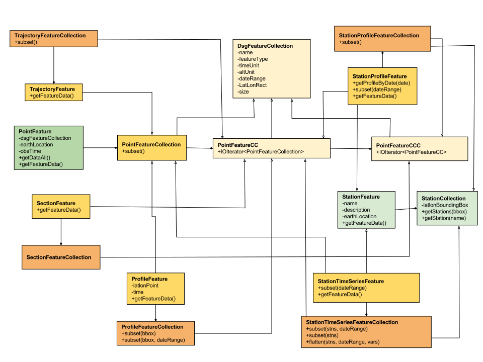
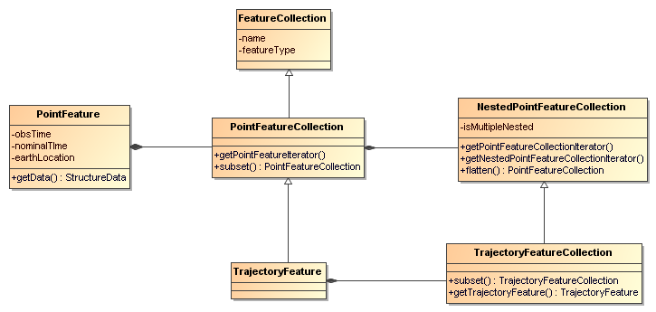

= Point Feature Datasets
:linkcss:
:stylesheet: ../../cdm.css

*_Point Feature Datasets_* (also known as _Discrete Sampling Geometry (DSG) datasets_) are collections of Point Features.
Point Feature Datasets contain one or more DsgFeatureCollections:

[source,java]
----
public interface ucar.nc2.ft.FeatureDatasetPoint extends ucar.nc2.ft.FeatureDataset {
  List<DsgFeatureCollection> getPointFeatureCollectionList();
}
----

[source,java]
----
public interface DsgFeatureCollection {
  String getName();
  ucar.nc2.constants.FeatureType getCollectionFeatureType();
  CalendarDateUnit getTimeUnit();
  String getAltUnits();
  CalendarDateRange getCalendarDateRange();
  ucar.unidata.geoloc.LatLonRect getBoundingBox();
  int size();
}
----

We take the approach that all point feature types are arrangements of collections of _PointFeatures_
(a set of measurements at the same point in space and time), distinguished by the geometry and topology of the collections.
The *_Point Feature Types_* that we implement are:

.  *Point feature* : one or more parameters measured at one point in time and space.
.  *Station time series feature* : a time-series of data points all at the same location, with varying time.
.  *Profile feature* : a set of data points along a vertical line.
.  *Station Profile feature* : a time-series of profile ****features at a named location.
.  *Trajectory feature* : a set of data points along a 1D curve in time and space.
.  *Section feature* : a collection of profile**** features which originate along a trajectory.

Related documents:
^^^^^^^^^^^^^^^^^^

* CF 1.6 http://cfconventions.org/1.6.html#discrete-sampling-geometries[Discrete Sampling Geometries Conventions]
* CDM Feature Types _draft_ link:../../CDM/CDMfeatures.doc[doc]
* CDM Point Feature Types _draft_ link:../../CDM/CDMpoints.doc[doc]
* Complete link:PointUML.html[Point Feature UML]

'''''

== Point Features

A *PointFeature* is a collection of data taken at a single time and a single place:

[source,java]
----
public interface PointFeature {
  DsgFeatureCollection getFeatureCollection();

  ucar.unidata.geoloc.EarthLocation getLocation();

  double getObservationTime();
  CalendarDate getObservationTimeAsCalendarDate();
  double getNominalTime();
  CalendarDate getNominalTimeAsCalendarDate();
  CalendarDateUnit getTimeUnit();

  ucar.ma2.StructureData getDataAll() throws java.io.IOException;
  ucar.ma2.StructureData getFeatureData() throws java.io.IOException;
}
----

The time can be retrieved as a CalendarDate or as a double in units of _getFeatureCollection().getTimeUnit()_.
The actual time of the data sample is the *observation time*, and is always present.
Some observational systems bin data into standard intervals, in which case there is also a **nominal time**.
When the nominal time is not given in the data, it is usually set to the observational time.
Conversion between time as a double and as a *CalendarDate* is done by _getFeatureCollection().getTimeUnits()_.

When a PointFeature is  part of nested features, _getDataAll()_ will return the data with all of the parent data in
as single StructureData object, while _getFeatureData()_ will return the data at just the innermost feature. See example below.

The _location_ is returned as:

[source,java]
----
public interface ucar.unidata.geoloc.EarthLocation {
  double getLatitude();
  double getLongitude();
  double getAltitude();
  ucar.unidata.geoloc.LatLonPoint getLatLon();
}
----

The _latitude_ and _longitude_ are required, while the _altitude_ may be missing and if so, is set to __Double.NaN__.
The altitude units (if they exist) can be found from _getFeatureCollection().getAltUnits()_.

The actual data of the observation is contained in a **link:../StructureData.html#StructureData[ucar.ma2.StructureData]**, which has a collection of
*StructureMembers* which describe the individual data members**,** along with many convenience routines for extracting the data.

=== PointFeatureCollection

A PointFeatureCollection is a collection of PointFeatures:

[source,java]
----
public interface PointFeatureCollection extends DsgFeatureCollection, Iterable<PointFeature> {

  PointFeatureCollection subset(LatLonRect boundingBox, CalendarDateRange dateRange) throws IOException;
}
----

A *PointFeatureCollection* inherits from *DsgFeatureCollection*, and so has a _name, featureType, and timeUnit_.
The _size, boundingBox, and dateRange_ may not be known until after iterating through the
collection, that is, actually reading the data.
You can force the discovery of these by calling _ucar.nc2.ft.point.DsgCollectionHelper.calcBounds()_.

A PointFeatureCollection implements _Iterable<PointFeature>_, so can be used in a *_foreach_* block:

[source,java]
----
 for (PointFeature pf : pointFeatureCollection) {
   ...
 }
----

You may subset a PointFeatureCollection with a lat/lon bounding box, and/or a dateRange, for example:

[source,java]
----
CalendarDateRange dateRange = CalendarDateRange.of(start, end);
LatLonRect horizSubset = new LatLonRect(40,-105,10.0,20.0);

// get all the points in that subset
PointFeatureCollection subset = original.subset(horizSubset, dateRange);
for (PointFeature pf : subset) {
    ...
}
----

== Profile Features

A *ProfileFeature* is a collection of *PointFeatures* along a vertical line.

[source,java]
----
public interface ProfileFeature extends PointFeatureCollection, Iterable<PointFeature> {
  LatLonPoint getLatLon();
  CalendarDate getTime();
  StructureData getFeatureData() throws IOException;
}
----

*ProfileFeature* extends *PointFeatureCollection* and *DsgFeatureCollection*, so has a name, altUnit, etc.
The iteration will return *PointFeatures* that all belong to the same profile, with the same lat/lon point and varying heights.
The time values are often identical, although that is not required.

Since a profile is a *PointFeatureCollection*, it implements _Iterable<PointFeature>_, so you get its data using:

[source,java]
----
 for (PointFeature pf : profile) {
   ...
 }
----

=== ProfileFeatureCollection

A collection of *ProfileFeatures* is a *ProfileFeatureCollection*:

[source,java]
----
public interface ProfileFeatureCollection extends PointFeatureCC, Iterable<ProfileFeature> {
  ProfileFeatureCollection subset(LatLonRect boundingBox) throws IOException;
  ProfileFeatureCollection subset(LatLonRect boundingBox, CalendarDateRange dateRange) throws IOException;
}
----

To read all the data, iterate through each *ProfileFeature* in the collection, then through each *PointFeature* of the *ProfileFeature*:

[source,java]
----
for (ProfileFeature profile : profileFeatureCollection) {
  StructureData profileData = profile.getFeatureData();
  for (PointFeature obs : profile) {
    StructureData obsData = obs.getFeatureData();
    ...
  }
}
----

Data associated with the entire profile will be found in _profile.getFeatureData()_, while the data along the z axis will
be in _obs.getFeatureData()_.

You may *subset* a ProfileFeatureCollection with a lat/lon bounding box, getting back another *ProfileFeatureCollection*.
Typically this is a logical subset, and no data is read until you iterate over the subset:

[source,java]
----
LatLonRect wantBB = new LatLonRect("-60,120,12,20");
ProfileFeatureCollection subset = profileFeatureCollection.subset(wantBB);

// get all the profiles in the specified bounding box
for (ProfileFeature profile : subset) {
  for (PointFeature pointFeature : profile) {
    ...
  }
}
----

== Station Time Series Features

A *StationTimeSeriesFeature* is a time series of PointFeatures at a single, named location called a *Station*:

[source,java]
----
public interface StationTimeSeriesFeature extends Station, PointFeatureCollection {
  String getName();
  String getDescription();
  String getWmoId();
  double getLatitude();
  double getLongitude();
  double getAltitude();
  LatLonPoint getLatLon();

  StructureData getFeatureData() throws IOException;

  StationTimeSeriesFeature subset(CalendarDateRange dateRange) throws IOException;
}
----

*StationTimeSeriesFeature* extends *PointFeatureCollection* and *DsgFeatureCollection*, so has a _name, altUnit, timeUnits_, etc.
It also extends *Station* and so has a _description, lat, lon, altitude_ and so on.

An iteration will return *PointFeatures* that all belong to the same station. These may or may not be time-ordered. One can also
subset on _dateRange_:

[source,java]
----
CalendarDateRange dateRange = CalendarDateRange.of(start, end);
PointFeatureCollection subset = stationTimeSeriesCollection.subset(dateRange);
for (PointFeature pointFeature : subset) {
  StationPointFeature stationFeature = (StationPointFeature) pointFeature;
  String stationName = stationFeature.getName();
  StructureData allData = pointFeature.getDataAll();
  ...
}
----

The *PointFeature* will extend *StationPointFeature*, so that the station information is available from it.
The example also shows getting a single *StructureData* that will include the data from both the station and the observation.

=== StationTimeSeriesFeatureCollection

A *StationTimeSeriesFeatureCollection* is a collection of stations with time series data at each:

[source,java]
----
public interface StationTimeSeriesFeatureCollection extends StationCollection, PointFeatureCC, Iterable<StationTimeSeriesFeature> {

  List<Station> getStations();
  List<Station> getStations(LatLonRect subset);
  ucar.nc2.ft.Station getStation(String stationName);
  ucar.unidata.geoloc.LatLonRect getBoundingBox();

  List<StationFeature> getStationFeatures() throws IOException;
  List<StationFeature> getStationFeatures( LatLonRect boundingBox) throws IOException;
  List<StationFeature> getStationFeatures( List<String> stnNames)  throws IOException;
  StationTimeSeriesFeature getStationFeature(Station s) throws IOException;
  Station getStation(PointFeature feature) throws IOException;

  StationTimeSeriesFeatureCollection subset(List<Station> stations) throws IOException;
  StationTimeSeriesFeatureCollection subsetFeatures(List<StationFeature> stations) throws IOException;
  StationTimeSeriesFeatureCollection subset(LatLonRect boundingBox) throws IOException;
  StationTimeSeriesFeatureCollection subset(List<Station> stns, CalendarDateRange dateRange) throws IOException;
  StationTimeSeriesFeatureCollection subset(LatLonRect boundingBox, CalendarDateRange dateRange) throws IOException;

  PointFeatureCollection flatten(List<String> stations, CalendarDateRange dateRange, List<VariableSimpleIF> varList) throws IOException;
  PointFeatureCollection flatten(LatLonRect llbbox, CalendarDateRange dateRange) throws IOException;
}
----

A *StationTimeSeriesFeatureCollection* is a collection of stations, extending *StationCollection*, from which you can get the list of available
stations, a bounding box, etc. You may subset the collection by passing in a list of stations, a lat/lon bounding box, and/or a dateRange.
You may _flatten_ the collection, making it into a collection of PointFeatures. The flattening may include
subsetting by lat/lon bounding box, and/or a dateRange. Flattening can sometimes improve performance.

To access the data, get a *StationTimeSeriesFeature* for a specified Station, or iterate over all *StationTimeSeriesFeatures* in the
collection:

[source,java]
----
for (StationTimeSeriesFeature timeSeries : stationCollection) {
  for (ucar.nc2.ft.PointFeature pointFeature : timeSeries) {
    ...
  }
}
----

To get a time series at a particular station:

[source,java]
----
Station stn = stationTimeSeriesCollection.getStation("FXOW");
StationTimeSeriesFeature timeSeries = stationTimeSeriesCollection.getStationFeature(stn);
for (ucar.nc2.ft.PointFeature pointFeature : timeSeries) {
  ...
}
----

To get all *PointFeatures* in a specific area and time range, it can help performance sometimes to
flatten the *StationTimeSeriesCollection*, so that the points can be returned in the order they are
stored, instead of sorting by Station. One can still retrieve the associated station by casting the
*PointFeature* to a *StationPointFeature*:

[source,java]
----
LatLonRect bb = new LatLonRect( new LatLonPointImpl(40.0, -105.0),
                                new LatLonPointImpl(42.0, -100.0));
CalendarDateRange dateRange = CalendarDateRange.of(start, end);
PointFeatureCollection points = stationTimeSeriesCollection.flatten(bb,dateRange);
for (PointFeature pointFeature : points) {
  StationPointFeature stationFeature = (StationPointFeature) pointFeature;
  String stationName = stationFeature.getName();
}
----

You may *flatten* a ProfileFeatureCollection with a lat/lon bounding box, and/or a dateRange, which throws away all the connectedness information of
the profile, and treats the data as a collection of points. In this case, you get back a **PointFeatureCollection**:

[source,java]
----
LatLonRect wantBB = new LatLonRect("-60,120,12,20");
CalendarDateRange dateRange = CalendarDateRange.of(start, end);
PointFeatureCollection subset = profileFeatureCollection.flatten(wantBB, dateRange);

// get all the points in that subset
for ( ucar.nc2.ft.PointFeature pointFeature : subset) {
  ...
}
----

== Trajectory Features

=== TrajectoryFeature

=== TrajectoryFeatureCollection

== Station Profile Features

image:StationProfile.png[image]

A *StationProfileFeature* is a time series of ProfileFeatures at a single, named location.

[source,java]
----
public interface StationProfileFeature extends Station, NestedPointFeatureCollection {

  String getName();
  String getDescription();
  String getWmoId();

  double getLatitude();
  double getLongitude();
  double getAltitude();
  ucar.unidata.geoloc.LatLonPoint getLatLon();

  PointFeatureCollection flatten(LatLonRect, CalendarDateRange);
  StationProfileFeature subset(CalendarDateRange);
}
----

A *StationProfileFeature* is a collection of ProfileFeatures, extending *NestedPointFeatureCollection*, all at the same location,
thus its a time series of profiles at a named location.
To access the data, you can iterate over all *ProfileFeatures* in the collection, then through all *PointFeatures* of the *ProfileFeature*:

[source,java]
----
for (ucar.nc2.ft.ProfileFeature profile : stationProfileFeature) {
  for (ucar.nc2.ft.PointFeature pointFeature : profile) {
    ...
  }
}
----

Note that the _flatten(LatLonRect, CalendarDateRange)_ method, inherited from the *NestedPointFeatureCollection* interface, is not normally useful here, since
the lat/lon values are identical. Subsetting on just the CalendarDateRange is useful, however, and returns another *StationProfileFeature* whose
ProfileFeatures lie within the specified range of dates.

=== StationProfileFeatureCollection

A *StationProfileFeatureCollection* is a collection of *StationProfileFeature*, ie. a collection of time series of ProfileFeatures
at named locations.

[source,java]
----
  public interface StationProfileFeatureCollection extends StationCollection, NestedPointFeatureCollection {

    String getName();

    List<Station> getStations();
    List<Station> getStations(LatLonRect subset);
    Station getStation(String stationName);
    LatLonRect getBoundingBox();

    PointFeatureCollection flatten(LatLonRect, CalendarDateRange);
    StationProfileFeatureCollection subset(List<Station> stns);
    StationProfileFeature getStationProfileFeature(Station stn);
  }
----

A *StationProfileFeatureCollection* extends *StationCollection*, from which you can get the list of available Stations, a bounding box, etc. Note how
the *StationCollection* interface makes handling StationProfileFeatureCollection identical to StationTimeSeriesFeatureCollection. You may subset the
collection by passing in a list of Stations, or get a *StationProfileFeature* from a specific station.

To run through all the data, iterate through each *StationProfileFeature* in the collection, then through each *ProfileFeature* in the
*StationProfileFeature*, then through each *PointFeature* of the *ProfileFeatures*:

[source,java]
----
for (StationProfileFeature stationProfile : stationProfileFeatureCollection) {
  for (ProfileFeature profile : stationProfile) {
    for (PointFeature pointFeature : profile) {
      ...
    }
  }
}
----

As usual, you can *flatten* the collection, throwing away the station and profile information, and making it into a collection of PointFeatures. The
flattening may include subsetting by lat/lon bounding box, and/or a dateRange.

'''''

image:../../nc.gif[image] This document was last updated Sept 2015
