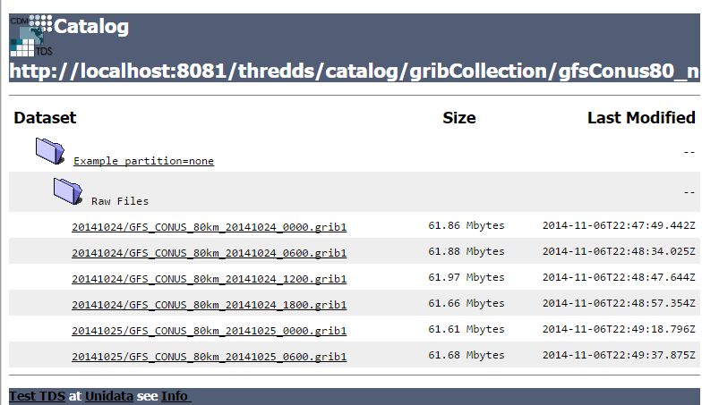

:source-highlighter: coderay
[[threddsDocs]]
:toc:

= Time Partitions

== Overview

All of the GRIB records in all of the files that you specify constitute a _GRIB collection_.
The CDM creates one or more _CDM datasets_ from this collection.
There is always an overall __collection dataset__, and for large collections you may want to also present smaller subsets, for
example yearly subsets of a multiyear model run.
To do so, GRIB collections can be divided up into __time partitions__, based on the reference time of the GRIB records.

You may also want to partition your collection due to memory constraints or in order to speed up indexing.
To build an index, all of the metadata of each GRIB record is read into memory.
This is somewhere between 200-1000 bytes / record.
A good estimate is twice the sum of the sizes of all the GRIB index files (gbx9 files) in the collection.
This memory is only required when building the index, and after the indexes are built, the memory usage is
proportional to the size of the CDM index files (ncx files).
For example, if you have 1 million records in your collection, you may need ~500 MB of main memory for the indexing.
The time it takes to index also increases with the number of GRIB records (probably somewhat more than linearly).
When your collection is changing, partitioned collections will only have to update the partitions that change.
All of these are reasons you may want to use time partitioning.

See <<TDM#,here>> for options on how to get your collections indexed.

== Homogeneity requirements

A _feature collection dataset_ is a homogeneous collection of records.
That means that the metadata describing the dataset is approximately the
same for all of the records. Each GRIB record is self-contained, in the
sense that it does not reference other records, or an overall schema.
The point of making a collection of GRIB records into a CDM dataset, is
to allow the user to access the entire collection at once, using the
netCDF API for multidimensionsal arrays. The user cannot, using the
netCDF API, access the metadata for individual GRIB records. Instead, we
assume that the metadata is uniform in the collection, and expose it
with variable and global attributes.

== Time Partitions

A time partition is the partitioning of the GRIB records into disjoint
sets, based on the reference time of the GRIB records. (For model runs
the reference time is usually the model run time). The partitioning
is controlled by the *timePartition* attribute on the
<**collection**> element inside the <**featureCollection**>, eg:

[source,xml]
-----------------------------------------------------------------------------------
  <featureCollection name="NCEP GFS model" featureType="GRIB1" path="test/all">
    <metadata inherited="true">
      <serviceName>all</serviceName>
      <dataFormat>GRIB-1</dataFormat>
    </metadata>
    <collection name="gfs" spec="/data/GFS/**/.*\.grb$" timePartition="directory"/>
  </featureCollection>
-----------------------------------------------------------------------------------

For each partition, a CDM index file is created, and a CDM collection dataset can be acccessed by the user.

The possible values of *timePartition* are:

1.  *none*: all files are scanned in, and one collection level index is built.
2.  *directory*: each directory is a partition. Nested directories create nested partitions (eg year/month/day).
3.  *file*: each file is a partition.
4.  *_<time unit>_*: the files are divided into partitions based on the given time unit. The reference time must be encoded in the filenames.
This is the only time you need to use a **dateFormatMark**.

=== Directory Partition

In order to use a directory partition, the directory structure must partition the data by reference time.
That is, all of the data for any given reference time must be completely contained in the directory.
Directories can be nested to any level.
To use, add the attribute *_timePartition="directory"_*, or simply omit, as this is the default.

=== File Partition

In order to use a file partition, all of the records for a reference time must be contained in a single file.
The common case is that each file contains all of the records for a single reference time. To use, put *_timePartition="file"_*.

=== Time Partition

In order to use a time partition, the filenames must contain parseable time information than can be used to partition the data.
The directory layout, if any, is not used.
The common case is where all files are in a single directory, and each file has the reference date encoded in the name.
The split-out of variables does not matter.

If a collection is configured as a time partition, all of the filenames are read into memory at once.
A date extractor must be specified, and is used to group the files into partitions.
For example, if *_timePartition = "1 year"_*, all of the files for each calendar year are made into a collection.
The overall dataset is the collection of all of those yearly collections.

=== None Partition

If a collection is configured with *_timePartition="none"_*, all of the records’ metadata (excluding the data itself) will be read into memory at once.
A single top-level collection is written.

This option is good option for small-medium collections (say < 1M records) which are not time-partitioned by directory.
Note that this option takes the longest when indexing, and other strategies
are preferred for large collections, especially if the collection is dynamic and must be reindexed often.

== Collection storage strategies

Assuming that you have control over how GRIB records are stored in the files, here are some best practices to consider.

Generally, managing many small files has more overhead than managing
smaller numbers of large files. For today’s disks, file sizes of of 100
Mb - 10 Gb seems right. Keep the number of files in a directory small, a
few hundred is best, and more than a thousand starts to make things like
directory listings hard.

Partition your files by reference time, which typically is the model run
time. Depending on size and number, you might create directories by day, month, year, etc.

When you have complete control over how the collection is stored on
disk, and you want to optimize for fastest THREDDS indexing and
retrieval, *file partitions* are recommended. Placing all of the records
for a single reference time in a single file is often optimal. If there
are a small number of records for each runtime ( < a few tens of thousands?) you might
want to put more than one reference time in each file. Its essential
that all the records for each runtime be in a single file.

GRIB files are unordered collections of GRIB records, and the CDM simply scans the files in the collection, looking for GRIB headers.
So you can concatenate GRIB files together just using the *cat* command.
You can also create tar files; the internal files are ignored and the tar file simply is seen as a collection of GRIB records.
Other archives which dont compress are also useable. However zip and gzip are not currently useable in this way.

If you reorganize your file collection, delete any previous THREDDS index files
(_.gbx9_ and _.ncx4_) and regenerate them with the TDM.
If you store indexes seperate from the data, make sure you track down those directories and delete old index files.

== Examples

=== Example 1 (timePartition="none"):

  <featureCollection featureType="GRIB1" name="gfsConus80_none" path="gribCollection/gfsConus80_none">
    <collection spec="${cdmUnitTest}/gribCollections/gfs_conus80/**/.*grib1$" timePartition="none"/>
  </featureCollection>

[source,xml]
------------------------------------------------------------------------------------------------
<featureCollection featureType="GRIB1" name="gfsConus80_none" path="gribCollection/gfsConus80_none"> # <1>
 <metadata inherited="true"> # <2>
      <documentation type="summary">This dataset blah blah blah</documentation>
      <documentation xlink:href="http://www.rda.ucar.edu/rda/docs#ds099.9"
            xlink:title="RDA Information"/>
 </metadata>

 <collection name="ds099.9" # <3>
    spec="Q:/cdmUnitTest/gribCollections/rdavm/ds099.9/PofP/**/.*grib1" # <4>
    timePartition="none"/> # <5>

   <update startup="never" trigger="allow"/> # <6>
   <tdm rewrite="test" rescan="0 0/15 * * * ? *" /> # <7>
   <gribConfig datasetTypes="TwoD Latest Best" /> # <8>
</featureCollection>
------------------------------------------------------------------------------------------------

<1>  A *featureCollection* must have a _name_, a _featureType_ and a _path_ (do *not* set an _ID_ attribute).
The name is "human readable" and may change at will.
Note that the *featureType* attribute must now equal _GRIB1_ or _GRIB2_, not plain _GRIB_.
<2>  A featureCollection is an InvDataset, so it can contain any elements an InvDataset can contain, such as metadata.
Do not set _dataType_ or _dataFormat_, as these are set automatically.
Note that we dont set the serviceName, so the defualt service is used.
<3>  The collection *name* should be short but descriptive, it must be unique across all collections on your TDS, and should not change.
<4>  The <<CollectionSpecification#,collection specification>> defines the collection of files that are in this dataset.
<5>  The partitionType is *_none_*.
<6>  This *update* element tells the TDS to use the existing indices, and to read them only when an external trigger is sent.
This is the default behavior, so could be ommitted
<7>  This *tdm* element tells the <<TDM#,TDM>> to test every 15 minutes if the collection has changed, and to rewrite the indices when it has changed.
<8>  <<GribConfig#,GRIB specific configuration>>, in this case add both the full 2D time collection dataset and the Best, and also a resolver link to
the latest file.

In this case, all files are read in by the TDS and a single collection index is made.
Two datasets (TwoD and Best)are created for the entire collection. The simplified catalog is:

[source,xml]
----
  <dataset name="NCEP GFS Puerto_Rico (191km)">
    <metadata inherited="true">
      <serviceName>VirtualServices</serviceName>
      <dataType>GRID</dataType>
      <dataFormat>GRIB-2</dataFormat>
    </metadata>
    <dataset name="Full Collection (Reference / Forecast Time) Dataset" ID="fmrc/NCEP/GFS/Puerto_Rico/TwoD" urlPath="fmrc/NCEP/GFS/Puerto_Rico/TwoD">
      <documentation type="summary">Two time dimensions: reference and forecast; full access to all GRIB records</documentation>
    </dataset>
    <dataset name="Best NCEP GFS Puerto_Rico (191km) Time Series" ID="fmrc/NCEP/GFS/Puerto_Rico/Best" urlPath="fmrc/NCEP/GFS/Puerto_Rico/Best">
      <documentation type="summary">Single time dimension: for each forecast time, use GRIB record with smallest offset from reference time</documentation>
    </dataset>
    <dataset name="Latest Collection for NCEP GFS Puerto_Rico (191km)" urlPath="latest.xml">
      <serviceName>latest</serviceName>
    </dataset>
  </dataset>
----

=== Example 2 (timePartition="directory"):

[source,xml]
----
<featureCollection featureType="GRIB1" name="rdavm partition directory" path="gribCollection/pofp">
  <collection name="ds083.2-directory" spec="Q:/cdmUnitTest/gribCollections/rdavm/ds083.2/PofP/**/.*grib1" timePartition="directory"/> # <1>
</featureCollection>
----

<1>  The collection is divided into partitions by directory. In order to use this, you cannot have two GRIB records with the same
reference time in different directories.

=== Example 3 (timePartition="file"):

[source,xml]
----
<featureCollection featureType="GRIB1" name="rdavm partition directory" path="gribCollection/pofp">
  <collection name="ds083.2-directory" spec="Q:/cdmUnitTest/gribCollections/rdavm/ds083.2/PofP/**/.*grib1" timePartition="file"/> # <1>
</featureCollection>
----

<1>  The collection is divided into partitions by files. In order to use this, you cannot have two GRIB records with the same
reference time in different files.

A time partition generates one collection dataset, one dataset for each
partition, and one dataset for each individual file in the collection:

[source,xml]
-----------------------------------------------------------------------------------------------------------------------------------------
<dataset name="NAM-Polar90" ID="grib/NCEP/NAM/Polar90">
  <catalogRef xlink:href="/thredds/catalog/grib/NCEP/NAM/Polar90/collection/catalog.xml" xlink:title="collection"/>
  <catalogRef xlink:href="/thredds/catalog/grib/NCEP/NAM/Polar90/NAM-Polar90_20110301/catalog.xml" xlink:title="NAM-Polar90_20110301">
    <catalogRef xlink:href="/thredds/catalog/grib/NCEP/NAM/Polar90/NAM-Polar90_20110301/files/catalog.xml" xlink:title="files" />
  </catalogRef>
  <catalogRef xlink:href="/thredds/catalog/grib/NCEP/NAM/Polar90/NAM-Polar90_20110302/catalog.xml" xlink:title="NAM-Polar90_20110302">
    <catalogRef xlink:href="/thredds/catalog/grib/NCEP/NAM/Polar90/NAM-Polar90_20110302/files/catalog.xml" xlink:title="files" name="" />
  </catalogRef>
  ...
</dataset>
-----------------------------------------------------------------------------------------------------------------------------------------

de-referencing the catalogRefs, and simplifying:

[source,xml]
-------------------------------------------------------------------------------------------------------------------------------------
<dataset name="NAM-Polar90" ID="grib/NCEP/NAM/Polar90">
1)<dataset name="NAM-Polar90-collection" urlPath="grib/NCEP/NAM/Polar90/collection">
2)<dataset name="NAM-Polar90_20110301" urlPath="grib/NCEP/NAM/Polar90/NAM-Polar90_20110301/collection">
3)  <dataset name="NAM_Polar_90km_20110301_0000.grib2" urlPath="grib/NCEP/NAM/Polar90/files/NAM_Polar_90km_20110301_0000.grib2"/>

    <dataset name="NAM_Polar_90km_20110301_0600.grib2" urlPath="grib/NCEP/NAM/Polar90/files/NAM_Polar_90km_20110301_0600.grib2"/>
    ...
  </dataset>
4)<dataset name="NAM-Polar90_20110302-collection" urlPath="grib/NCEP/NAM/Polar90/NAM-Polar90_20110302/collection">
    <dataset name="NAM_Polar_90km_20110302_0000.grib2" urlPath="grib/NCEP/NAM/Polar90/files/NAM_Polar_90km_20110302_0000.grib2"/>

    <dataset name="NAM_Polar_90km_20110302_0600.grib2" urlPath="grib/NCEP/NAM/Polar90/files/NAM_Polar_90km_20110302_0600.grib2"/>
    ...
  </dataset>
  ...
</dataset>
-------------------------------------------------------------------------------------------------------------------------------------

1.  The overall collection dataset
2.  The first partition collection, with a partitionName =
name**_startingTime**
3.  The files in the first partition
4.  The second partition collection, etc

So the datasets that are generated from a Time Partition with **name**,
**path**, and **partitionName**:

[cols=",,,",options="header",]
|=======================================================================
|dataset |catalogRef |name |path
|collection |path/__collection/catalog.xml__ |name
|path/name__/collection__

|partitions |path/partitionName__/catalog.xml__ |partitionName
|path/partitionName/__collection__

|individual files |path/partitionName/__files/catalog.xml__ |filename
|path/__files__/filename
|=======================================================================

=== Example 3 (Multiple Groups)

When a Grib Collection contains multiple horizontal domains (i.e.
distinct Grid Definition Sections (GDS)), each domain gets placed into a
seperate group. As a rule, one can’t tell if there are seperate domains
without reading the files. If you open this collection through the CDM
(eg using ToolsUI) you would see a dataset that contains groups. The
TDS, however, separates groups into different datasets, so that each
dataset has only a single (unnamed, aka __root__) group.

[source,xml]
--------------------------------------------------------------------------------------------
 <featureCollection name="RFC" featureType="GRIB" path="grib/NPVU/RFC">
   <metadata inherited="true">
     <dataFormat>GRIB-1</dataFormat>
     <serviceName>all</serviceName>
   </metadata>
   <collection spec="/tds2012data/grib/rfc/ZETA.*grib1$" dateFormatMark="yyyyMMdd#.grib1#"/>
1) <gribConfig>
          <gdsHash from="-752078894" to="1193085709"/>
          <gdsName hash='-1960629519' groupName='KTUA:Arkansas-Red River RFC'/>
          <gdsName hash='-1819879011' groupName='KFWR:West Gulf RFC'/>
          <gdsName hash='-1571856555' groupName='KORN:Lower Mississippi RFC'/>
          <gdsName hash='-1491065322' groupName='KKRF:Missouri Basin RFC'/>
          <gdsName hash='-1017807718' groupName='TSJU:San Juan PR WFO'/>
          <gdsName hash='-1003775954' groupName='NCEP-QPE National Mosaic'/>
          <gdsName hash='-529497359' groupName='KRHA:Middle Atlantic RFC'/>
          <gdsName hash='289752153' groupName='KRSA:California-Nevada RFC-6hr'/>
          <gdsName hash='424971237' groupName='KRSA:California-Nevada RFC-1hr'/>
          <gdsName hash='511861653' groupName='KTIR:Ohio Basin RFC'/>
          <gdsName hash='880498701' groupName='KPTR:Northwest RFC'/>
          <gdsName hash='1123818409' groupName='KTAR:Northeast RFC'/>
          <gdsName hash='1174418106' groupName='KNES-National Satellite Analysis'/>
          <gdsName hash='1193085709' groupName='KMSR:North Central RFC'/>
          <gdsName hash='1464276934' groupName='KSTR:Colorado Basin RFC'/>
          <gdsName hash='1815048381' groupName='KALR:Southeast RFC'/>
   </gribConfig>

 </featureCollection>
--------------------------------------------------------------------------------------------

1.  This dataset has many different groups, and we are using a
<gribConfig> element to name them (see <<GribConfig#,below>> for
details).

==== Resulting Datasets:

For each group, this generates one collection dataset, and one dataset
for each individual file in the group:

[source,xml]
-------------------------------------------------------------------------------------------------------------------------------
<catalog>
  <dataset name="KALR:Southeast RFC" urlPath="grib/NPVU/RFC/KALR-Southeast-RFC/collection">
    <catalogRef xlink:href="/thredds/catalog/grib/NPVU/RFC/KALR-Southeast-RFC/files/catalog.xml" xlink:title="files" name="" />
  </dataset>
  <dataset name="KFWR:West Gulf RFC" urlPath="grib/NPVU/RFC/KFWR-West-Gulf-RFC/collection">
    <catalogRef xlink:href="/thredds/catalog/grib/NPVU/RFC/KFWR-West-Gulf-RFC/files/catalog.xml" xlink:title="files" name="" />
  </dataset>
  ...
</catalog>
-------------------------------------------------------------------------------------------------------------------------------

Note that the groups are sorted by name, and that there is no overall
collection for the dataset. Simplifying:

[source,xml]
---------------------------------------------------------------------------------------------------------------------
<catalog>
1)<dataset name="KALR:Southeast RFC" urlPath="grib/NPVU/RFC/KALR-Southeast-RFC/collection">
2)  <dataset name="ZETA_KALR_NWS_152_20120111.grib1" urlPath="grib/NPVU/RFC/files/ZETA_KALR_NWS_152_20120111.grib1"/>
    <dataset name="ZETA_KALR_NWS_160_20120111.grib1" urlPath="grib/NPVU/RFC/files/ZETA_KALR_NWS_160_20120111.grib1"/>
    ...
  </dataset>
3)<dataset name="KFWR:West Gulf RFC" urlPath="grib/NPVU/RFC/KFWR-West-Gulf-RFC/collection">
    <dataset name="ZETA_KFWR_NWS_152_20120111.grib1" urlPath="grib/NPVU/RFC/files/ZETA_KFWR_NWS_152_20120111.grib1"/>
    <dataset name="ZETA_KFWR_NWS_161_20120110.grib1" urlPath="grib/NPVU/RFC/files/ZETA_KFWR_NWS_161_20120110.grib1"/>
    ...
  </dataset>
   ...
 </catalog>
---------------------------------------------------------------------------------------------------------------------

1.  The first group collection dataset
2.  The files in the first group
3.  The second group collection dataset, etc

So the datasets that are generated from a Grib Collection with
*groupName* and *path* :

[cols=",,,",options="header",]
|=======================================================================
|dataset |catalogRef |name |path
|group collection |  |groupName |path/groupName/_collection_

|individual files |path/groupName/files/catalog.xml |filename
|path/_files_/filename
|=======================================================================

=== Example 4 (Time Partition with Multiple Groups):

Here is a time partitioned dataset with multiple groups:

[source,xml]
------------------------------------------------------------------------------
 <featureCollection name="NCDC-CFSR" featureType="GRIB" path="grib/NCDC/CFSR">
   <metadata inherited="true">
     <dataFormat>GRIB-2</dataFormat>
   </metadata>
   <collection spec="G:/nomads/cfsr/timeseries/**/.*grb2$"
1)     timePartition="directory"
2)     dateFormatMark="#timeseries/#yyyyMM"/>
   <update startup="true" trigger="allow"/>
   <gribConfig>
3)   <gdsHash from="1450218978" to="1450192070"/>
4)   <gdsName hash='1450192070' groupName='FLX GaussianT382'/>
     <gdsName hash='2079260842' groupName='FLX GaussianT62'/>
      ...
5)   <intvFilter excludeZero="true"/>
   </gribConfig>
 </featureCollection>
------------------------------------------------------------------------------

1.  Partition the files by which directory they are in (the files must
be time partitioned by the directories)
2.  One still needs a date extractor from the filename, even when using
a directory partition.
3.  Minor errors in GRIB coding can create spurious differernces in the
GDS. Here we correct one such problem (see <<GribConfig#,below>>
for details).
4.  Group renaming as in example 2
5.  Exclude GRIB records that have a time coordinate interval of (0,0)
(see <<GribConfig#,below>> for details).

==== Resulting Datasets:

A time partition with multiple groups generates an _overall collection
dataset_ for each group, a collection dataset for each group in each
partition, and a dataset for each individual file:

[source,xml]
----------------------------------------------------------------------------------------------------------------------
<dataset name="NCDC-CFSR" ID="grib/NCDC/CFSR">
1) <catalogRef xlink:href="/thredds/catalog/grib/NCDC/CFSR/collection/catalog.xml" xlink:title="collection" name="" />
4) <catalogRef xlink:href="/thredds/catalog/grib/NCDC/CFSR/200808/catalog.xml" xlink:title="200808" name="" />
8) <catalogRef xlink:href="/thredds/catalog/grib/NCDC/CFSR/200809/catalog.xml" xlink:title="200809" name="" />
   ...
</dataset>
----------------------------------------------------------------------------------------------------------------------

de-referencing the catalogRefs, and simplifying:

[source,xml]
--------------------------------------------------------------------------------------------------------------------------------------------
<dataset name="NCDC-CFSR" ID="grib/NCDC/CFSR">

1)<dataset name="NCDC-CFSR">
2)  <dataset name="FLX GaussianT382" urlPath="grib/NCDC/CFSR/NCDC-CFSR/FLX-GaussianT382"/>
3)  <dataset name="FLX GaussianT62" urlPath="grib/NCDC/CFSR/NCDC-CFSR/FLX-GaussianT62">
    ...
  </dataset>

4)<dataset name="200808" >
5)  <dataset name="FLX GaussianT382" urlPath="grib/NCDC/CFSR/200808/FLX-GaussianT382">
6)     <catalogRef xlink:href="/thredds/catalog/grib/NCDC/CFSR/200808/FLX-GaussianT382/files/catalog.xml" xlink:title="files" name="" />

    </dataset>
7)  <dataset name="FLX GaussianT62" urlPath="grib/NCDC/CFSR/200808/FLX-GaussianT62">
         <catalogRef xlink:href="/thredds/catalog/grib/NCDC/CFSR/200808/FLX-GaussianT62/files/catalog.xml" xlink:title="files" name="" />
    </dataset>
    ...
  </dataset>
8)<dataset name="200809" >
  ...

</dataset>
--------------------------------------------------------------------------------------------------------------------------------------------

1.  Container for the overall collection datasets
2.  The overall collection for the first group
3.  The overall collection for the second group, etc
4.  Container for the first partition
5.  The collection dataset for the first group of the first partition
6.  The individual files for the first group of the first partition, etc
7.  The collection dataset for the second group of the first partition,
etc.
8.  Container for the second partition, etc

So the datasets that are generated from a Time Partition with **name**,
**path**, **groupName**, and **partitionName**:

[cols=",,,",options="header",]
|=======================================================================
|dataset |catalogRef |name |path
|overall collection for group |path/groupName/__collection/catalog.xml__
|groupName |path/name/groupName

|collection for partition and group |path/partitionName__/catalog.xml__
|groupName |path/partitionName/groupName

|individual files |path/partitionName/groupName/__files/catalog.xml__
|partitionName/filename |path/__files__/filename
|=======================================================================

'''''

image:../../thread.png[image] This document was last updated MAr 2016
